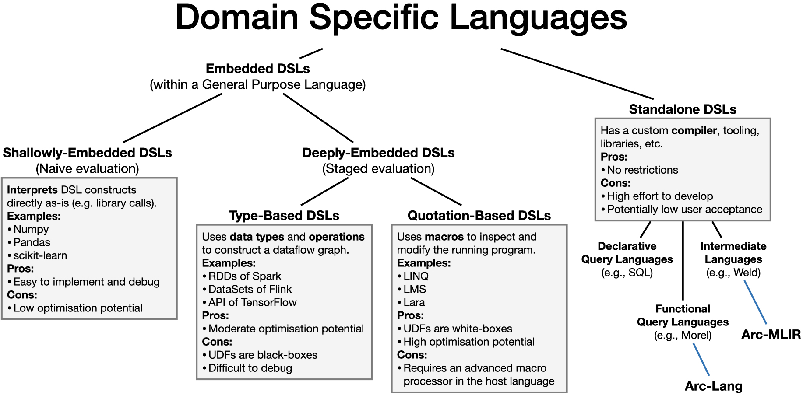

## Introduction

Arc-Lang is a programming language for continuous analytics. Continuous analytics is about analyzing data as soon as it is produced and possibly using the results for critical decision-making. Data is generally unstructured (e.g., images, audio, text) or semi-structured (e.g., JSON, XML, CSV), and is produced at a high velocity. Programs for continuous analytics must be able to scale-out their compute and storage while simultaneously execute forever with fault-tolerance.

```arc-lang
{{#include ../../arc-lang/examples/wordcount.arc:example}}
```

The goal of Arc-Lang is to make big-data analytics easy. Arc-Lang targets *streaming analytics* (i.e., processing data continuously as it is being generated) and *batch analytics* (i.e., processing data in large chunks all-at-once). From the streaming-perspective, Arc-Lang must be able to manage data at a fine granularity that is generated by many types of sensors, arriving at varying rates, in different formats, sizes, qualities, and possibly out-of-order. Datastreams can in addition be massive in numbers, ranging into the billions, due to the plethora of data sources that have emerged in the recent IoT boom. From the batch-perspective, Arc-Lang must be able to handle different kinds of collection-based data types whose sizes can scale to massive sizes, e.g., tensors and dataframes. Operations should to a large degree be agnostic of the collection type.

```arc-lang
{{#include ../../arc-lang/examples/wordcount.arc:polymorphic}}
```

To cope with the requirements of batch and stream data management, a runtime system is needed which can exploit distributed programming to enable scalability through partitioning and parallelism. Distributed programming is however difficult without abstraction. Application developers must manage problems such as fault tolerance, exactly-once-processing, and coordination while considering tradeoffs in security and efficiency. To this end, distributed systems leverage high-level DSLs which are more friendly towards end-users. DSLs in the form of query languages, frameworks, and libraries allow application developers to focus on domain-specific problems, such as the development of algorithms, and to disregard engineering-related issues. In addition, DSLs that are intermediate languages have been adopted by multiple systems both as a solution to enable reuse by breaking the dependence between the user and runtime, and to enable target-independent optimisation. There is always a tradeoff that must be faced in DSL design. DSLs make some problems easier to solve at the expense of making other problems harder to solve. How a DSL is implemented can also have an impact on its ability to solve problems. DSLs can be categorized as follows:



### Approach

In contrast to other DSLs, Arc-Lang is a standalone compiled DSL implemented in OCaml. The idea of Arc-Lang's is to combine general purpose imperative and functional programming over *small data* with declarative programming over *big data*. As an example, it should be possible to perform both fine-grained processing over individual data items of a datastream, while also being able to compose pipelines of relational operations through SQL-style queries. Arc-Lang is statically typed for the purpose of performance and safety, but at the same time also inferred and polymorphic to enable ease of use and reuse.

The approach of implementing the language as a standalone DSL allows for more creative freedom in the language design. At the same time, this approach requires everything, including optimisations and libraries, to be implemented from scratch.

To address the issue of optimisation, we are using the [MLIR](https://mlir.llvm.org/) compiler framework to implement Arc-MLIR - an intermediate language - which Arc-Lang programs translate into for optimisations. MLIR defines a universal intermediate language which can be extended with custom dialects. A dialect includes a set of operations, types, type rules, analyses, rewrite rules (to the same dialect), and lowerings (to other dialects). All dialects adhere to the same meta-syntax and meta-semantics which allows them to be interweaved in the same program code. The MLIR framework handles parsing, type checking, line information tracking among other things. Additionally, MLIR provides tooling for testing, parallel compilation, documentation, CLI usage, etc. The plan is to extend Arc-MLIR with custom domain-specific optimisations for the declarative part of Arc-Lang and to capitalize on MLIR's ability to derive general-purpose optimisations such as constant propagation for Arc-Lang's functional and imperative side.

To address the shortcoming of libraries, Arc-Lang allows both types and functions to be defined externally (inside Rust) and imported into the language. Most of the external functionality is encapsulated inside a runtime library named Arc-Sys. Arc-Sys builds on the [kompact](https://github.com/kompics/kompact) Component-Actor framework to provide distributed abstractions.

## Summary

In summary, Arc-Lang as a whole consists of three parts:

* **Arc-Lang**: A high-level programming language for big data analytics.
* **Arc-MLIR**: An intermediate language for optimising Arc-Lang.
* **Arc-Sys**: A distributed system for executing Arc-Lang.


