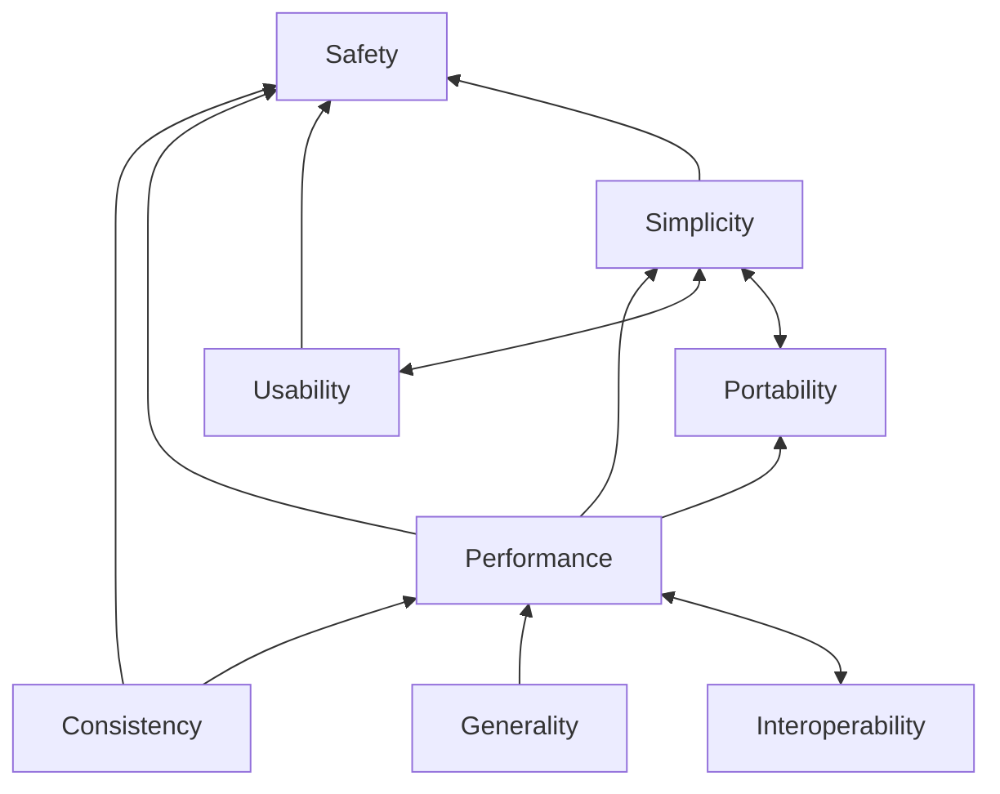

## Values

Arc-Lang has the following values:

* **Safety**: Arc-Lang should minimize the risk of errors to ensure code executes reliably.
* **Simplicity**: Arc-Lang should have a minimal design so that it is easy to learn and reason about.
* **Usability**: Arc-Lang should make programming effortless so that advanced tasks can be solved without the user having to create their own abstractions.
* **Performance**: Arc-Lang should have an efficient lightweight implementation that executes at near native speed.
* **Generality**: Arc-Lang should be able to solve a wide range of problems.
* **Consistency**: Arc-Lang should have clear semantics without implicit edge-case rules to make its behavior predictable and easier to understand.
* **Portability**: Arc-Lang should be able to run on a variety of platforms (e.g., locally, cluster, cloud) and architectures (i.e., target triples).
* **Interoperability**: Arc-Lang should be able to integrate other languages and systems, enabling developers to leverage existing code and resources.

## Distinctions

* **Safety** vs. **Simplicity**:

## Principles

In this section we describe the principles about how conflicts between values are resolved.

* **Safety** is more important than **Simplicity**.
    * **Rationale**: If a feature makes the language simpler, but leads to more bugs, it should not be added to the language.
    * **Example**: While the language could become simpler by removing the need for type annotations and static type checking, this would in the long term lead to unexpected problems at runtime such as crashes and data races. Safety is the most important value since dataflow applications can potentially run for an indefinite amount of time.
* **Simplicity** is equally important to **Usability**.
    * **Rationale**: The language must both be easy to get started with and also be able to have an extensive number of abstractions for solving advanced problems out-of-the-box.
    * **Example**: While the language syntax should be minimal, it is important that it also provides an intuitive syntax, a supportive development environment, and a rich standard library of data types and functions so that users need not build applications from scratch.
* **Simplicity** is more important than **Performance**.
    * **Rationale**: If a feature makes code more efficient, but heightens the learning curve of the language, it should not be added to the language.
    * **Example**: While optimal performance could be achieved by adopting Rust's ownership, borrowing, and lifetimes, this makes the language substantially more complicated. It is acceptable to trade some performance for simplicity by instead using runtime reference counting for automatic memory management.
* **Performance** is more important than **Generality**.
    * **Rationale**: If a feature makes the language able to do more things, but cannot be implemented efficiently, it should not be added to the language unless there are convincing use cases for it in dataflow programming.
    * **Example**: While major runtime extensions to Rust, such as garbage collection, reflection, dynamic type checking, or treating everything as an "object", could make the language more general, these additions make the implementation more complex and are known to bring severe performance overhead when used in data intensive computing applications. It is important that code compiles into idiomatic Rust where information about types and environments is erased.
* **Performance** is more important than **Consistency**.
    * **Rationale**: If making the language semantically consistent comes at the cost of potentially unpredictable performance, it is better to instead introduce an exception to the semantics as long as this is made clear to the user.
    * **Example**: While value semantics and immutable data types make program behavior easier to understand, it can lead to unexpected performance issues due to excessive copying when implemented with copy-on-write and fundamental time complexity drawbacks when implemented through fat nodes or path copying. Therefore, introducing mutable data structures which are passed by reference is acceptable. These data structures are deeply-copied when transferred between dataflow operators to avoid data races, but shallowly-copied when passed as arguments to regular functions, resulting in inconsistent semantics but reasonable performance.
* **Safety** is more important than **Consistency**.
    * **Rationale**: If a feature makes the language more semantically consistent, but potentially introduces errors, it should not be added to the language.
    * **Example**: While allowing users to access the underlying file system is essential for reading local data and configuration files, allowing this within dataflow operators could lead to undefined behavior if they are run on a distributed system. As a result, an effect system is used to statically forbid certain operations from being used inside dataflow graphs, leading to inconsistent design but safe behaviour.
* **Safety** is more important than **Performance**.
    * **Rationale**: If a feature makes the language more efficient, but potentially introduces errors, it should not be added to the language.
    * **Example**: While allowing users to manually manage memory and transmute bytes could make the language more efficient at managing resources, it can lead to undefined behaviour and memory leaks if not used properly. It is better to trade some performance to ensure safety.
* **Safety** is more important than **Interoperability**:
    * **Rationale**: The language must be able to use code from other languages, but it is important to minimize the risk of errors in such code. Therefore, we favor embedding languages that are known to be safe
    * **Example**: While we could theoretically allow embedding C code directly into programs, this could lead to unexpected memory problems. It is safer to embed languages which provide guarantees for memory safety such as Rust or Python.
* **Interoperability** is equally important to **Performance**.
    * **Rationale**: Functionality offered by the language should have an efficient implementation. Yet, the language must be able to use code from other languages. Such external code is viewed as a black box without any performance guarantees.
    * **Example**: When embedding Rust or Python code from other languages into programs, it is up to the user to ensure that the code executes efficiently.
* **Portability** is equally important to **Simplicity**.
    * **Rationale**: It should be possible to write programs that are portable across different architectures, but it should remain transparent how programs execute.
    * **Example**: When writing code that will run on different architectures, users should not have to specify conditional compilation flags. Higher level abstractions are needed with semantics that are equivalent across architectures.
